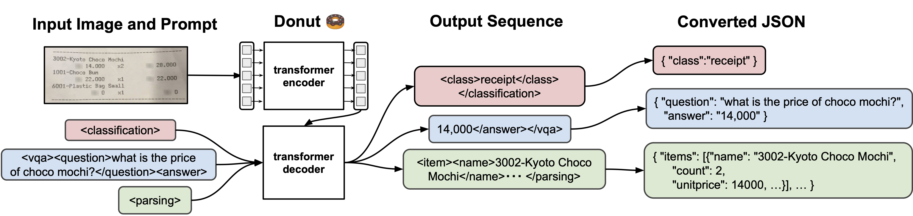
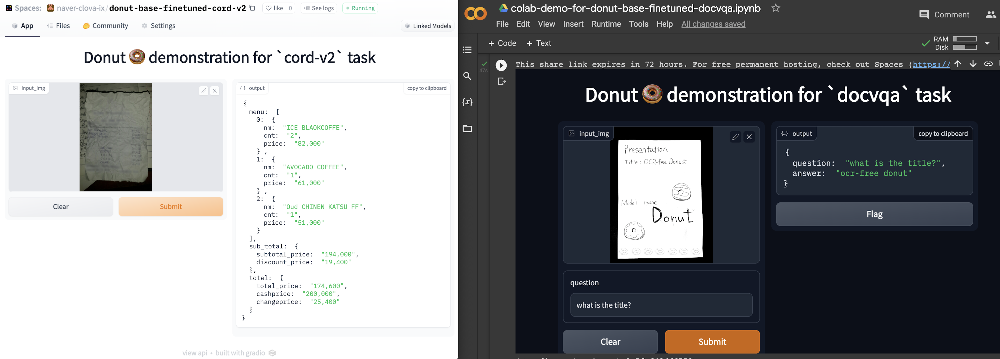
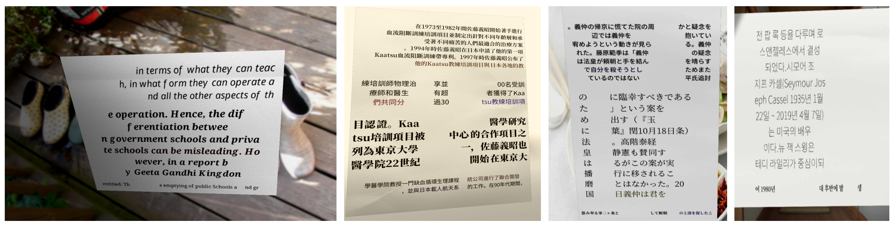

<div align="center">
    
# Donut 🍩 : Document Understanding Transformer

[](https://arxiv.org/abs/2111.15664)
[](#how-to-cite)
[](#demo)
[](#demo)
[](https://pypi.org/project/donut-python)
[](https://pepy.tech/project/donut-python)

Official Implementation of Donut and SynthDoG

</div>

## Introduction

**Donut** 🍩, **Do**cume**n**t **u**nderstanding **t**ransformer, is a new method of document understanding that utilizes an OCR-free end-to-end Transformer model. Donut does not require off-the-shelf OCR engines/APIs, yet it shows state-of-the-art performances on various visual document understanding tasks, such as visual document classification or information extraction (a.k.a. document parsing). 
In addition, we present **SynthDoG** 🐶, **Synth**etic **Do**cument **G**enerator, that helps the model pre-training to be flexible on vairous languages and domains.

Our academic paper, which describes our method in detail and provides full experimental results and analyses, can be found here:<br>
> [**OCR-free Document Understanding Transformer**](https://arxiv.org/abs/2111.15664).<br>
> [Geewook Kim](https://geewook.kim), [Teakgyu Hong](https://dblp.org/pid/183/0952.html), [Moonbin Yim](https://github.com/moonbings), [JeongYeon Nam](https://github.com/long8v), [Jinyoung Park](https://github.com/jyp1111), [Jinyeong Yim](https://jinyeong.github.io), [Wonseok Hwang](https://scholar.google.com/citations?user=M13_WdcAAAAJ), [Sangdoo Yun](https://sangdooyun.github.io), [Dongyoon Han](https://dongyoonhan.github.io), [Seunghyun Park](https://scholar.google.com/citations?user=iowjmTwAAAAJ). To appear at ECCV 2022.



## Pre-trained Models and Web Demos

Gradio web demos are available! [](#demo) [](#demo)
|:--:|
||
- You can run the demo with `./app.py` file.
- Sample images are available at `./misc` and more receipt images are available at [CORD dataset link](https://huggingface.co/datasets/naver-clova-ix/cord-v2).
- Web demos are available from the links in the following table.

|Task|Sec/Img|Score|Trained Model|<div id="demo">Demo</div>|
|---|---|---|---|---|
| [CORD](https://github.com/clovaai/cord) (Document Parsing)   |   0.7 /<br> 0.7 /<br> 1.2   |  93.7 /<br> 93.5 /<br> 93.5    | [donut-base-finetuned-cord-v2](https://huggingface.co/naver-clova-ix/donut-base-finetuned-cord-v2/tree/official) (1280) /<br> [donut-base-finetuned-cord-v1](https://huggingface.co/naver-clova-ix/donut-base-finetuned-cord-v1/tree/official) (1280) /<br> [donut-base-finetuned-cord-v1-2560](https://huggingface.co/naver-clova-ix/donut-base-finetuned-cord-v1-2560/tree/official) | [gradio space web demo](https://huggingface.co/spaces/naver-clova-ix/donut-base-finetuned-cord-v2),<br>[google colab demo](https://colab.research.google.com/drive/1o07hty-3OQTvGnc_7lgQFLvvKQuLjqiw?usp=sharing) |
| [Train Ticket](https://github.com/beacandler/EATEN) (Document Parsing)   |   0.6   |  98.8    | [donut-base-finetuned-zhtrainticket](https://huggingface.co/naver-clova-ix/donut-base-finetuned-zhtrainticket/tree/official) | [google colab demo](https://colab.research.google.com/drive/16O-hMvGiXrYZnlXA_tfJ9_q760YcLoOj?usp=sharing) |
| [RVL-CDIP](https://www.cs.cmu.edu/~aharley/rvl-cdip) (Document Classification)     |  0.75   |   95.3      | [donut-base-finetuned-rvlcdip](https://huggingface.co/naver-clova-ix/donut-base-finetuned-rvlcdip/tree/official) | [gradio space web demo](https://huggingface.co/spaces/nielsr/donut-rvlcdip),<br>[google colab demo](https://colab.research.google.com/drive/1xUDmLqlthx8A8rWKLMSLThZ7oeRJkDuU?usp=sharing) |
| [DocVQA Task1](https://rrc.cvc.uab.es/?ch=17) (Document VQA) |  0.78       | 67.5 | [donut-base-finetuned-docvqa](https://huggingface.co/naver-clova-ix/donut-base-finetuned-docvqa/tree/official) | [gradio space web demo](https://huggingface.co/spaces/nielsr/donut-docvqa),<br>[google colab demo](https://colab.research.google.com/drive/1Z4WG8Wunj3HE0CERjt608ALSgSzRC9ig?usp=sharing) |

The links to the pre-trained backbones are here:
- [`donut-base`](https://huggingface.co/naver-clova-ix/donut-base/tree/official): trained with 64 A100 GPUs (~2.5 days), number of layers (encoder: {2,2,14,2}, decoder: 4), input size 2560x1920, swin window size 10, IIT-CDIP (11M) and SynthDoG (English, Chinese, Japanese, Korean, 0.5M x 4).
- [`donut-proto`](https://huggingface.co/naver-clova-ix/donut-proto/tree/official): (preliminary model) trained with 8 V100 GPUs (~5 days), number of layers (encoder: {2,2,18,2}, decoder: 4), input size 2048x1536, swin window size 8, and SynthDoG (English, Japanese, Korean, 0.4M x 3).

Please see [our paper](#how-to-cite) for more details.

## SynthDoG datasets



The links to the SynthDoG-generated datasets are here:

- [`synthdog-en`](https://huggingface.co/datasets/naver-clova-ix/synthdog-en): English, 0.5M.
- [`synthdog-zh`](https://huggingface.co/datasets/naver-clova-ix/synthdog-zh): Chinese, 0.5M.
- [`synthdog-ja`](https://huggingface.co/datasets/naver-clova-ix/synthdog-ja): Japanese, 0.5M.
- [`synthdog-ko`](https://huggingface.co/datasets/naver-clova-ix/synthdog-ko): Korean, 0.5M.

To generate synthetic datasets with our SynthDoG, please see `./synthdog/README.md` and [our paper](#how-to-cite) for details.

## Updates

**_2022-08-23_** New version 1.0.7 is released (`pip install donut-python --upgrade`).<br>
**_2022-08-12_** Donut 🍩 is also available at [huggingface/transformers 🤗](https://huggingface.co/docs/transformers/main/en/model_doc/donut) (contributed by [@NielsRogge](https://github.com/NielsRogge)).<br>
**_2022-08-05_** A well-executed hands-on tutorial on donut 🍩 is published at [Towards Data Science](https://towardsdatascience.com/ocr-free-document-understanding-with-donut-1acfbdf099be) (written by [@estaudere](https://github.com/estaudere)).<br>
**_2022-07-20_** First Commit, We release our code, model weights, synthetic data and generator.

## Software installation

[](https://pypi.org/project/donut-python)
[](https://pepy.tech/project/donut-python)

```bash
pip install donut-python
```

or clone this repository and install the dependencies:
```bash
git clone https://github.com/clovaai/donut.git
cd donut/
conda create -n donut_official python=3.7
conda activate donut_official
pip install .
```

We tested [donut](https://github.com/clovaai/donut) with:
- [torch](https://github.com/pytorch/pytorch) == 1.11.0+cu113 
- [torchvision](https://github.com/pytorch/vision) == 0.12.0+cu113
- [pytorch-lightning](https://github.com/Lightning-AI/lightning) == 1.6.4
- [transformers](https://github.com/huggingface/transformers) == 4.11.3
- [timm](https://github.com/rwightman/pytorch-image-models) == 0.5.4

## Getting Started

### Data

This repository assumes the following structure of dataset:
```bash
> tree dataset_name
dataset_name
├── test
│   ├── metadata.jsonl
│   ├── {image_path0}
│   ├── {image_path1}
│             .
│             .
├── train
│   ├── metadata.jsonl
│   ├── {image_path0}
│   ├── {image_path1}
│             .
│             .
└── validation
    ├── metadata.jsonl
    ├── {image_path0}
    ├── {image_path1}
              .
              .

> cat dataset_name/test/metadata.jsonl
{"file_name": {image_path0}, "ground_truth": "{\"gt_parse\": {ground_truth_parse}, ... {other_metadata_not_used} ... }"}
{"file_name": {image_path1}, "ground_truth": "{\"gt_parse\": {ground_truth_parse}, ... {other_metadata_not_used} ... }"}
     .
     .
```

- The structure of `metadata.jsonl` file is in [JSON Lines text format](https://jsonlines.org), i.e., `.jsonl`. Each line consists of
  - `file_name` : relative path to the image file.
  - `ground_truth` : string format (json dumped), the dictionary contains either `gt_parse` or `gt_parses`. Other fields (metadata) can be added to the dictionary but will not be used.
- `donut` interprets all tasks as a JSON prediction problem. As a result, all `donut` model training share a same pipeline. For training and inference, the only thing to do is preparing `gt_parse` or `gt_parses` for the task in format described below.

#### For Document Classification
The `gt_parse` follows the format of `{"class" : {class_name}}`, for example, `{"class" : "scientific_report"}` or `{"class" : "presentation"}`.
- Google colab demo is available [here](https://colab.research.google.com/drive/1xUDmLqlthx8A8rWKLMSLThZ7oeRJkDuU?usp=sharing).
- Gradio web demo is available [here](https://huggingface.co/spaces/nielsr/donut-rvlcdip).

#### For Document Information Extraction
The `gt_parse` is a JSON object that contains full information of the document image, for example, the JSON object for a receipt may look like `{"menu" : [{"nm": "ICE BLACKCOFFEE", "cnt": "2", ...}, ...], ...}`.
- More examples are available at [CORD dataset](https://huggingface.co/datasets/naver-clova-ix/cord-v2).
- Google colab demo is available [here](https://colab.research.google.com/drive/1o07hty-3OQTvGnc_7lgQFLvvKQuLjqiw?usp=sharing).
- Gradio web demo is available [here](https://huggingface.co/spaces/naver-clova-ix/donut-base-finetuned-cord-v2).

#### For Document Visual Question Answering
The `gt_parses` follows the format of `[{"question" : {question_sentence}, "answer" : {answer_candidate_1}}, {"question" : {question_sentence}, "answer" : {answer_candidate_2}}, ...]`, for example, `[{"question" : "what is the model name?", "answer" : "donut"}, {"question" : "what is the model name?", "answer" : "document understanding transformer"}]`.
- DocVQA Task1 has multiple answers, hence `gt_parses` should be a list of dictionary that contains a pair of question and answer.
- Google colab demo is available [here](https://colab.research.google.com/drive/1Z4WG8Wunj3HE0CERjt608ALSgSzRC9ig?usp=sharing).
- Gradio web demo is available [here](https://huggingface.co/spaces/nielsr/donut-docvqa).

#### For (Psuedo) Text Reading Task
The `gt_parse` looks like `{"text_sequence" : "word1 word2 word3 ... "}`
- This task is also a pre-training task of Donut model.
- You can use our **SynthDoG** 🐶 to generate synthetic images for the text reading task with proper `gt_parse`. See `./synthdog/README.md` for details.

### Training

This is the configuration of Donut model training on [CORD](https://github.com/clovaai/cord) dataset used in our experiment. 
We ran this with a single NVIDIA A100 GPU.

```bash
python train.py --config config/train_cord.yaml \
                --pretrained_model_name_or_path "naver-clova-ix/donut-base" \
                --dataset_name_or_paths '["naver-clova-ix/cord-v2"]' \
                --exp_version "test_experiment"    
  .
  .                                                                                                                                                                                                                                         
Prediction: <s_menu><s_nm>Lemon Tea (L)</s_nm><s_cnt>1</s_cnt><s_price>25.000</s_price></s_menu><s_total><s_total_price>25.000</s_total_price><s_cashprice>30.000</s_cashprice><s_changeprice>5.000</s_changeprice></s_total>
Answer: <s_menu><s_nm>Lemon Tea (L)</s_nm><s_cnt>1</s_cnt><s_price>25.000</s_price></s_menu><s_total><s_total_price>25.000</s_total_price><s_cashprice>30.000</s_cashprice><s_changeprice>5.000</s_changeprice></s_total>
Normed ED: 0.0
Prediction: <s_menu><s_nm>Hulk Topper Package</s_nm><s_cnt>1</s_cnt><s_price>100.000</s_price></s_menu><s_total><s_total_price>100.000</s_total_price><s_cashprice>100.000</s_cashprice><s_changeprice>0</s_changeprice></s_total>
Answer: <s_menu><s_nm>Hulk Topper Package</s_nm><s_cnt>1</s_cnt><s_price>100.000</s_price></s_menu><s_total><s_total_price>100.000</s_total_price><s_cashprice>100.000</s_cashprice><s_changeprice>0</s_changeprice></s_total>
Normed ED: 0.0
Prediction: <s_menu><s_nm>Giant Squid</s_nm><s_cnt>x 1</s_cnt><s_price>Rp. 39.000</s_price><s_sub><s_nm>C.Finishing - Cut</s_nm><s_price>Rp. 0</s_price><sep/><s_nm>B.Spicy Level - Extreme Hot Rp. 0</s_price></s_sub><sep/><s_nm>A.Flavour - Salt & Pepper</s_nm><s_price>Rp. 0</s_price></s_sub></s_menu><s_sub_total><s_subtotal_price>Rp. 39.000</s_subtotal_price></s_sub_total><s_total><s_total_price>Rp. 39.000</s_total_price><s_cashprice>Rp. 50.000</s_cashprice><s_changeprice>Rp. 11.000</s_changeprice></s_total>
Answer: <s_menu><s_nm>Giant Squid</s_nm><s_cnt>x1</s_cnt><s_price>Rp. 39.000</s_price><s_sub><s_nm>C.Finishing - Cut</s_nm><s_price>Rp. 0</s_price><sep/><s_nm>B.Spicy Level - Extreme Hot</s_nm><s_price>Rp. 0</s_price><sep/><s_nm>A.Flavour- Salt & Pepper</s_nm><s_price>Rp. 0</s_price></s_sub></s_menu><s_sub_total><s_subtotal_price>Rp. 39.000</s_subtotal_price></s_sub_total><s_total><s_total_price>Rp. 39.000</s_total_price><s_cashprice>Rp. 50.000</s_cashprice><s_changeprice>Rp. 11.000</s_changeprice></s_total>
Normed ED: 0.039603960396039604                                                                                                                                  
Epoch 29: 100%|█████████████| 200/200 [01:49<00:00,  1.82it/s, loss=0.00327, exp_name=train_cord, exp_version=test_experiment]
```

Some important arguments:

- `--config` : config file path for model training.
- `--pretrained_model_name_or_path` : string format, model name in huggingface modelhub or local path.
- `--dataset_name_or_paths` : string format (json dumped), list of dataset names in huggingface datasets or local paths.
- `--result_path` : file path to save model outputs/artifacts.
- `--exp_version` : used for experiment versioning. The output files are saved at `{result_path}/{exp_version}/*`

### Test

With the trained model, test images and ground truth parses, you can get inference results and accuracy scores.

```bash
python test.py --dataset_name_or_path naver-clova-ix/cord-v2 --pretrained_model_name_or_path ./result/train_cord/test_experiment --save_path ./result/output.json
100%|█████████████| 100/100 [00:35<00:00,  2.80it/s]
Total number of samples: 100, Tree Edit Distance (TED) based accuracy score: 0.9374973163596032, F1 accuracy score: 0.8406020841373987
```

Some important arguments:

- `--dataset_name_or_path` : string format, the target dataset name in huggingface datasets or local path.
- `--pretrained_model_name_or_path` : string format, the model name in huggingface modelhub or local path.
- `--save_path`: file path to save predictions and scores.

## How to Cite
If you find this work useful to you, please cite:
```
@article{kim2021donut,
   title={OCR-free Document Understanding Transformer},
   author={Kim, Geewook and Hong, Teakgyu and Yim, Moonbin and Nam, JeongYeon and Park, Jinyoung and Yim, Jinyeong and Hwang, Wonseok and Yun, Sangdoo and Han, Dongyoon and Park, Seunghyun},
   journal={arXiv preprint arXiv:2111.15664},
   year={2021}
}
```

## License

```
MIT license

Copyright (c) 2022-present NAVER Corp.

Permission is hereby granted, free of charge, to any person obtaining a copy
of this software and associated documentation files (the "Software"), to deal
in the Software without restriction, including without limitation the rights
to use, copy, modify, merge, publish, distribute, sublicense, and/or sell
copies of the Software, and to permit persons to whom the Software is
furnished to do so, subject to the following conditions:

The above copyright notice and this permission notice shall be included in
all copies or substantial portions of the Software.

THE SOFTWARE IS PROVIDED "AS IS", WITHOUT WARRANTY OF ANY KIND, EXPRESS OR
IMPLIED, INCLUDING BUT NOT LIMITED TO THE WARRANTIES OF MERCHANTABILITY,
FITNESS FOR A PARTICULAR PURPOSE AND NONINFRINGEMENT.  IN NO EVENT SHALL THE
AUTHORS OR COPYRIGHT HOLDERS BE LIABLE FOR ANY CLAIM, DAMAGES OR OTHER
LIABILITY, WHETHER IN AN ACTION OF CONTRACT, TORT OR OTHERWISE, ARISING FROM,
OUT OF OR IN CONNECTION WITH THE SOFTWARE OR THE USE OR OTHER DEALINGS IN
THE SOFTWARE.
```
